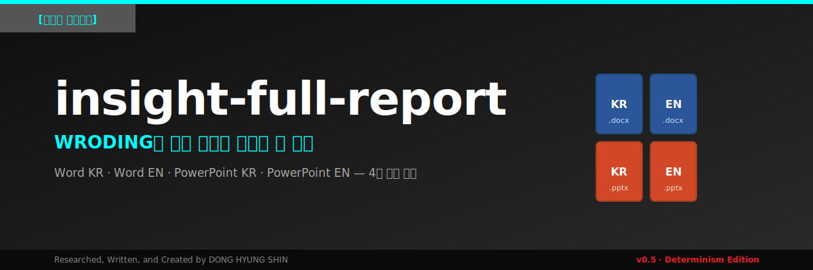
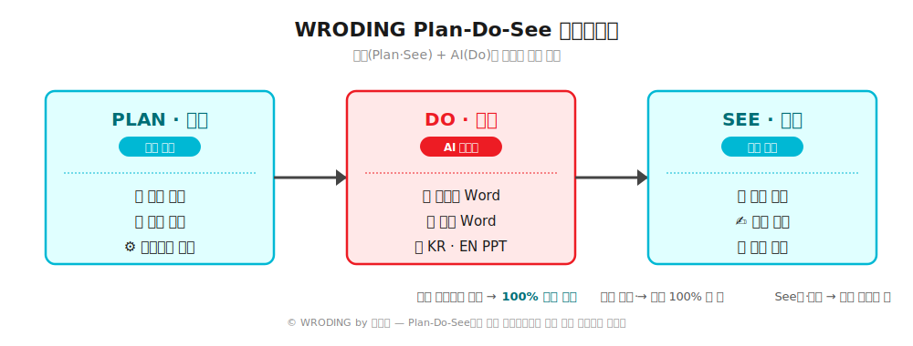

<div align="center">



# insight-full-report

**WRODING의 분석 보고서 작성을 한 줄로**

Claude에 "보고서 만들어줘" 한마디로 **한국어 Word · 영어 Word · 한국어 PowerPoint · 영어 PowerPoint** 4종 문서를 동시에 생성하는 플러그인입니다.

[](LICENSE)
[](#)
[](https://claude.com)
[](#-wroding-시리즈)

</div>

---

## 🪄 WRODING이란?

**WRODING(롸딩)** 은 **WR**iting과 co**DING**을 결합한 신조어로, AI 시대의 새로운 글쓰기 방식을 의미합니다.

AI 이전의 글쓰기가 "자료 수집 → 분석 → 글쓰기 → 퇴고"의 완벽한 수직 통합 공정이었다면, AI 시대의 글쓰기는 "자료 수집 → **프롬프팅** → AI 생성 → 퇴고 → 편집"으로 재편되었습니다. **코딩하듯이 명령(프롬프팅)을 설계해서 글을 만들어내는 것**이 WRODING의 핵심입니다.

이 플러그인은 신동형의 WRODING 방법론 중 **"3년차 애널리스트 수준 이상의 분석 보고서 작성"** 워크플로우 전체를 자동화한 도구입니다. 평소 7~8개의 프롬프팅을 순서대로 입력해야 했던 작업이 단 한 줄(`보고서 만들어줘`)로 완결됩니다.

---

## 🎯 이 플러그인이 자동화하는 것

소스(URL · YouTube · PDF · 문서 · 텍스트)를 입력받아 **Top tier 증권사 애널리스트 수준**의 분석 보고서를 한국어·영어, Word·PowerPoint 4종 포맷으로 동시에 생성합니다.

전통적인 WRODING 워크플로우와의 비교:

| 단계 | 전통적 WRODING | insight-full-report |
|---|---|---|
| 소스 학습 | Prompting ① | ✅ 자동 |
| 목차 · Executive Summary | Prompting ② · ③ | ✅ 자동 |
| 본문 작성 (analyst 산문체) | Prompting ④ | ✅ 자동 |
| Executive Summary 재작성 | Prompting ⑤ | ✅ 자동 |
| SEO · GEO · AEO 해시태그 | Prompting ⑥ | ✅ 자동 |
| 영어 번역 | Prompting ⑦ | ✅ 자동 |
| 보고서 템플릿 편집 | 사람 수작업 | ✅ 자동 |
| **PowerPoint 생성** | **별도 SLODING 필요** | ✅ **포함** |

---

## 📊 Plan-Do-See 프레임워크

WRODING은 **Plan(계획) — Do(실행) — See(검증)** 프레임워크로 구조화됩니다. 이 플러그인은 **Do 단계를 100% 자동화**하고, Plan·See 단계는 사용자가 주도합니다.



자료 수집까지 본인이 직접 검수하면 **100% 본인이 롸딩한 결과물**, AI에 위임하면 "거의 100% 내가 쓴 글"의 위계로 작품성이 달라집니다.

---

## 📦 생성되는 4종 문서

| 파일명 | 언어 | 포맷 | 특징 |
|---|---|---|---|
| `{주제}_KR_Report_{날짜}.docx` | 한국어 | Word | analyst 산문체, Malgun Gothic, 입니다·합니다 격식체 |
| `{주제}_EN_Report_{날짜}.docx` | English | Word | Analyst prose, Arial |
| `{주제}_KR_Presentation_{날짜}.pptx` | 한국어 | PowerPoint | 5-Zone 레이아웃, 13슬라이드 7챕터 |
| `{주제}_EN_Presentation_{날짜}.pptx` | English | PowerPoint | Same structure, English content |

4개 파일 모두 **표지 → 목차 → Executive Summary → 본문 7챕터 → 시사점·전망 → 맺음말**의 일관된 구조를 따르며, 핵심 메시지가 4개 문서에서 완벽히 정합됩니다.

---

## 🚀 빠른 시작 (Quick Start)

### 설치

Claude Code 또는 Cowork에서 다음 명령어를 입력하세요:

```bash
/plugin marketplace add dhshin0604/insight-full-report
/plugin install insight-full-report
```

### 사용

자료(URL · PDF · 문서 · 텍스트)를 첨부한 후 Claude에게 다음과 같이 요청합니다:

```
보고서 만들어줘
```

또는 영어로:

```
generate full report
```

5~10분 후 4종 문서가 동시에 생성됩니다.

### 트리거 문구 (Triggers)

다음 문구 중 하나만 포함되면 자동으로 작동합니다.

- **한국어**: 보고서 만들어 · 워드랑 파워포인트 만들어 · 4종 문서 · 신동형 스타일 · 인사이트 보고서
- **English**: generate full report · make study materials · word and pptx · insight report · shin style report

---

## 🛠️ 기술 세부사항 (v0.5 Determinism Edition)

v0.5는 **결과 재현성(Determinism)**에 집중했습니다. 같은 입력이면 Opus 4.6과 Sonnet 4.6 어디서 돌려도 동일한 결과가 나옵니다.

- **`build_pptx.sh` 오케스트레이터** — OOXML 조작(unpack/sldIdLst/slide layout 패치/Google strip/pack)을 외부 bash로 분리. 모델은 콘텐츠만 작성합니다.
- **`verify_toc.py`** — TOC(slide2)의 로마숫자 챕터와 본문 z1 헤더를 1:1 매칭 검증. 누락 · 순서불일치 · 중복 시 빌드 중단.
- **맺음말 슬라이드 자동 마지막 배치** — sldIdLst에서 closing slide를 마지막으로 강제 이동.
- **slide3 layout 자동 보정** — chapter divider(layout3) → contents(layout5) 패치.
- **폰트 자동 조달** — GitHub raw 차단 환경에서도 `pip install koreanize-matplotlib`로 NanumGothic 확보.
- **GATE 0/1 + ANTI-DRIFT 14개 금지패턴** — SKILL.md에 자기검증 체크리스트 내장.
- **`TARGET_UNPACKED` 환경변수** — 절대경로 의존성 제거, 어느 세션에서도 동작합니다.

---

## 🧬 WRODING 시리즈

`insight-full-report`는 신동형의 **WRODING 시리즈** 중 첫 번째 도구입니다.

| 시리즈 | 의미 | 산출물 | 상태 |
|---|---|---|---|
| **WRODING** (Writing + Coding) | 글쓰기 · 보고서 작성 | Word + PowerPoint 4종 | ✅ **insight-full-report** (현재 저장소) |
| **DRODING** (Draw + Coding) | 시각 콘텐츠 생성 | 4컷 만화 · 인포그래픽 | 🚧 준비 중 |
| **SLODING** (Slide + Coding) | 슬라이드 단독 생성 | Google Slides · PPT | 🚧 준비 중 |

---

## 👤 저자 소개

**신동형 (DH Shin · 申东亨)**

- (現) 알서포트 전략기획팀장
- (前) 게임 소셜 미디어 게임덕 대표이사
- (前) LG경영연구원 산업부문 책임연구원
- (前) 서울대학교 경영대학 석사
- (前) 삼성전자 무선 사업부 지원 그룹

**연락 & 링크**

- 📧 [donghyung.shin@gmail.com](mailto:donghyung.shin@gmail.com)
- 🔗 신동형의 테크 지식 탐험 (블로그)
- 💼 LinkedIn
- 👤 네이버 인물정보

> ※ 위 링크 자리에 실제 URL을 채워 넣으시면 됩니다.

---

## 📜 인용 및 저작권

> **편안하게 활용하시고 많이 공유해 주세요.**
> **단, 인용 시 반드시 출처를 밝혀 주십시오.**

**인용 양식 (Citation Format)**

```
신동형 (2026). insight-full-report: WRODING 기반 분석 보고서 자동 생성기 (v0.5).
GitHub. https://github.com/dhshin0604/insight-full-report
```

본 저장소는 [MIT License](LICENSE)를 따릅니다. 상업적 이용을 포함한 자유로운 활용이 가능하나, 위 인용 양식을 통한 출처 표기를 부탁드립니다.

---

<div align="center">

**Researched, Written, and Created by DONG HYUNG SHIN**

`#wroding` · `#analyst-report` · `#claude-plugin` · `#신동형인사이트` · `#롸딩`

</div>
